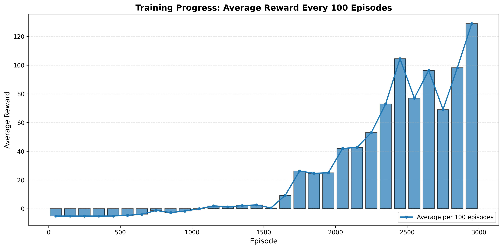

# Flappy Bird Reinforcement Learning

A Deep Q-Network (DQN) implementation with Double Q-Learning that trains an AI agent to play Flappy Bird using reinforcement learning.

---

## Trained Agent Demo

Below is a GIF showing the DQN agent successfully playing Flappy Bird after training.

<p align="center">
  
</p>

---

## Features

- **Double DQN**: Reduces overestimation bias by separating action selection from action evaluation
- **Experience Replay**: Stores past experiences in a replay buffer for more stable learning
- **Target Network**: Maintains a separate target network that updates periodically for training stability
- **Epsilon-Greedy Exploration**: Balances exploration and exploitation with decaying epsilon
- **Custom Reward Shaping**: Enhanced reward signals to guide learning more effectively
---

## Training Progress

The following plot shows the average reward progression over 3000 episodes of training:

 

---

## Requirements

```
flappy-bird-gymnasium
gymnasium
numpy
torch
```

Install dependencies:
```bash
pip install flappy-bird-gymnasium gymnasium numpy torch
```


---

## Usage

### 1. Clone or download this repository
```bash
git clone https://github.com/Mahdi-Razi-Gandomani/flappy-bird-DQN.git
cd flappy-bird-DQN
```

### 2. Run training
```bash
python3 flappyBirdDQN.py
```

---

## Details

### Network

The Q-Network consists of:
- Input layer: State size (12 features from the environment)
- Hidden layer 1: 256 neurons with ReLU activation
- Hidden layer 2: 256 neurons with ReLU activation
- Output layer: 2 neurons (action Q-values for "do nothing" and "flap")

### Reward Shaping

The agent uses modified rewards to accelerate learning:
- **Passing a pipe**: +10.0
- **Dying**: -10.0
- **Staying alive**: +0.1

This reward structure encourages the agent to stay alive while heavily rewarding successful pipe navigation.

## How It Works

1. **Initialization**: The agent starts with random weights and high exploration

2. **Episode Loop**: For each episode:
   - Reset the environment
   - Select actions using epsilon-greedy
   - Store experiences in replay buffer
   - Sample random mini-batches and train the network
   - Update target network periodically
   - Decay exploration rate

3. **Double DQN Update**: 
   - Use online network to select best action for next state
   - Use target network to evaluate that action's Q-value
   - Compute TD target: `reward + gamma * Q_target(next_state, argmax Q_online(next_state))`
   - Minimize MSE loss between predicted and target Q-values

4. **Testing**: After training, run the agent for 5 episodes to visualize performance

---

## References

[1] V. Mnih et al., *Human-level control through deep reinforcement learning*,  
Nature, vol. 518, pp. 529–533, 2015.  
https://www.nature.com/articles/nature14236  

[2] H. van Hasselt, A. Guez, and D. Silver, *Deep Reinforcement Learning with Double Q-Learning*,  
Proceedings of the AAAI Conference on Artificial Intelligence, 2016.  
https://arxiv.org/abs/1509.06461  

[8] Flappy Bird Gymnasium Environment (Talendar),  
https://github.com/Talendar/flappy-bird-gymnasium  


